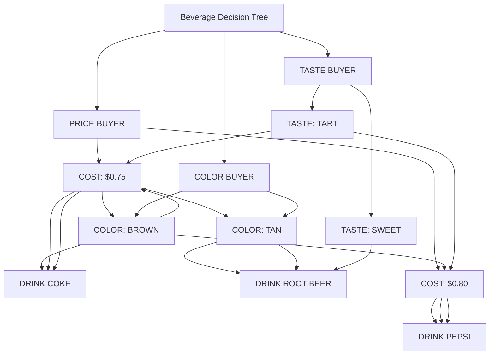

# Python Implementation of Neil Larson's PERM Decision Tree Builder

This project is a Python implementation of Neil Larson's DOS-based **PERM Decision Tree Builder**, a tool designed to convert three hierarchical input files into a decision tree or search tree. Originally developed for DOS, PERM used text-based input files created with Larson's MaxThink outliner. This implementation preserves that functionality while allowing the use of any ASCII text editor.

## Table of Contents
- [Overview](#overview)
- [Input Files](#input-files)
  - [Attribute File (A)](#attribute-file-a)
  - [Category File (B)](#category-file-b)
  - [Priority File (C)](#priority-file-c)
- [File Conversion](#file-conversion)
- [Output Example](#output-example)
- [Usage](#usage)

## Overview
PERM processes three input files—**Attributes File**, **Category File**, and **Priority File**—to generate a decision tree. These files use a hierarchical structure, with indentation (**tabs**) to denote levels. The output is a minimal-path decision tree, useful for decision-making processes like selecting a beverage based on attributes such as cost, color, and taste.

## Input Files

### Attribute File (A)

The **Attributes File** defines the items and their properties. Below is an example of the **tab indented** attributes file for selecting a beverage:
```plaintext
TITLE
    DRINK COKE
        COLOR: BROWN
        COST: $0.75
        TASTE: TART
    DRINK PEPSI
        TASTE: TART
        COLOR: BROWN
        COST: $0.80
    DRINK ROOT BEER
        COLOR: TAN
        COST: $0.75
        TASTE: SWEET
```

- **Notes**:
  - Attribute tags (e.g., `COLOR`, `COST`, `TASTE`) are optional but must be consistent across files.
  - Indentation indicates hierarchy (using **tabs**).

### Category File (B)
The **Category File** organizes attributes into decision-making categories. It is derived from the Attribute File.

The Category File (B) may also be created using grep as follows:

```bash
grep -P ^'\t\t’ a | sort -u > b
```
Edit the resulting file (B) to add the questions. Below is an example of a **tab indented** category file:

```plaintext
TITLE
    How much does it cost?
        COST: $0.75
        COST: $0.80
    What is the color?
        COLOR: BROWN
        COLOR: TAN
    What is the taste?
        TASTE: SWEET
        TASTE: TART
```

- **Notes**:
  - Questions group related attributes.
  - Must align with attributes defined in the Attributes File.

### Priority File (C)
The **Priority File** defines the order of decision-making criteria for different user types. It is derived from the Category File. 

The Priority File may be created using grep and sed as follows:

```bash
grep -P ^'\t[[:alpha:]]' b | shuf | sed -e 's/^/\t/' | sed -e '$s/$/\n/' >> c
```

Run the command above serveral times and edit the resulting file (C) to organize and prioritize the contents. Below is an example of a **tab indented** priority file:

```plaintext
Beverage Decision Tree
    PRICE BUYER
        How much does it cost?
        What is the color?
        What is the taste?
    COLOR BUYER
        What is the color?
        What is the taste?
        How much does it cost?
    TASTE BUYER
        What is the taste?
        What is the color?
        How much does it cost?
```

- **Notes**:
  - Each buyer type prioritizes categories differently.
  - Order of questions determines the decision path.

## File Conversion
If using a text editor other than MaxThink, ensure compatibility with indentation:
- **Convert tabs to spaces (MaxThink format)**:
  ```bash
  cat a.otl | expand --tabs=1 > a.mt
  ```
- **Convert spaces to tabs (PERM format)**:
  ```bash
  cat a.mt | unexpand --tabs=1 > a.otl
  ```
## Output Example
Running `perm a b c > d` generates a **tab indented** output file (`d`) with minimal decision paths:

```plaintext
Beverage Decision Tree
    PRICE BUYER
        COST: $0.75
            COLOR: BROWN
                DRINK COKE
            COLOR: TAN
                DRINK ROOT BEER
        COST: $0.80
            DRINK PEPSI
    COLOR BUYER
        COLOR: BROWN
            COST: $0.75
                DRINK COKE
            COST: $0.80
                DRINK PEPSI
        COLOR: TAN
            DRINK ROOT BEER
    TASTE BUYER
        TASTE: SWEET
            DRINK ROOT BEER
        TASTE: TART
            COST: $0.75
                DRINK COKE
            COST: $0.80
                DRINK PEPSI
```

- **Result**: A structured tree showing optimal decisions based on buyer priorities.



## Usage
1. Prepare the three input files (`a`, `b`, `c`) as described above.
2. Run the program from the command line:
   ```bash
   perm a b c > d
   ```
3. Check the output file (`d`) for the generated decision tree.

## License
This project is licensed under the Apache License 2.0. See the [LICENSE](https://github.com/buckeye43210/pyPERM_DecisionTree/blob/main/LICENSE) file for details.
